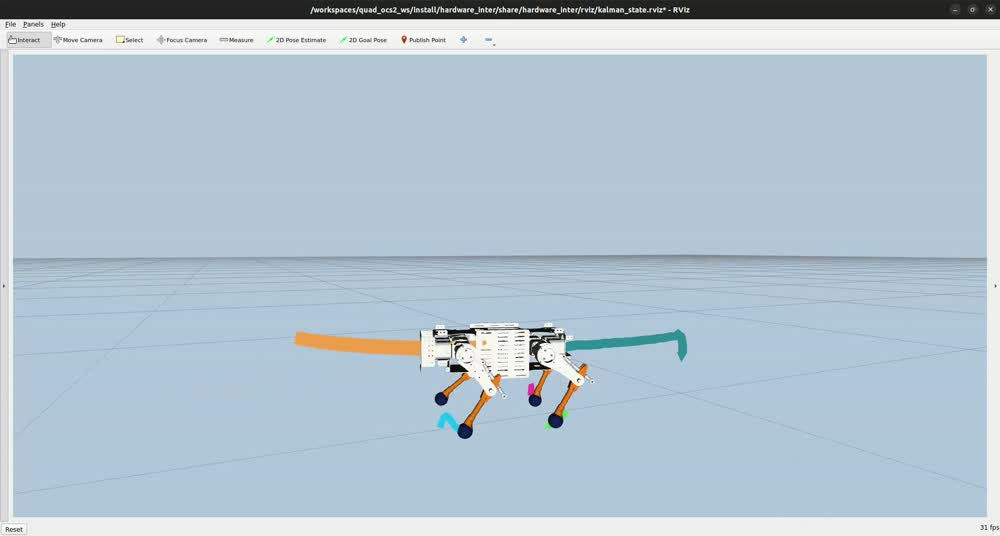
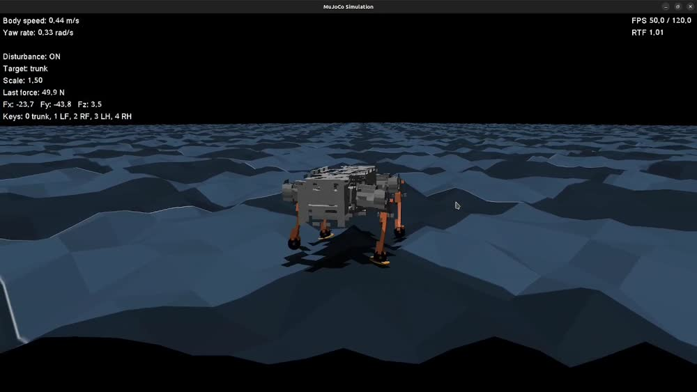

# OCS2 Quad Mini

ROS 2 Humble workspace for quadruped locomotion on the Quad Mini platform. The project combines OCS2 MPC/WBC, MuJoCo simulation, Gazebo/Ignition simulation, RViz visualization, Docker-based development, and real-robot bridge tooling.

The current maintained robots are:

- `quad_mini_tuned`: tuned simulation workflow for MuJoCo and Gazebo.
- `quad_mini_real`: real-robot and hardware-bridge workflow.

## What This Workspace Provides

- OCS2 nonlinear MPC and whole-body control for quadruped locomotion.
- MuJoCo simulation backend with direct simulator feedback.
- Gazebo/Ignition backend using `ros2_control` effort interfaces.
- Custom Gazebo effort controller using:

```text
tau = tau_ff + kp * (q_des - q) + kd * (dq_des - dq)
```

- IMU, odometry, joint state, and estimated-contact bridge paths.
- RViz moving-base visualization for simulator and hardware topics.
- Docker workflow with ROS 2 Humble, MuJoCo, Gazebo, ros2_control, and OCS2 dependencies.

## Demo

### MPC Flat Walking in RViz

[](docs/media/mpc_rviz_flat_walk.mp4)

### RL Rough Terrain Walking

[](docs/media/rl_test_rough.mp4)

## Repository Layout

```text
.
├── build.sh                         # Full Docker image + workspace build
├── docs/media/                      # README demo media
├── run.sh                           # Main launcher wrapper
├── docker/                          # Docker image and entrypoint
├── rebuild_tools/                   # Targeted rebuild helpers
├── tools/                           # tmux launch orchestration and utilities
└── src/Quadruped-Control-OCS2-ROS2/
    ├── legged_control/
    │   ├── gazebo_effort_controller/ # Custom ros2_control effort controller
    │   ├── launch_simulation/        # MuJoCo/Gazebo/controller launch files
    │   ├── motion_control/           # MPC/WBC and RL command publishers
    │   ├── mujoco_simulator/         # MuJoCo/Gazebo robot assets
    │   ├── real_robot_bridge/        # Simulator/hardware bridge
    │   └── user_command/             # Robot configs, gait, reference commands
    ├── ocs2_ros2/                    # Vendored OCS2 ROS 2 stack
    ├── pinocchio/
    ├── hpp-fcl/
    └── qpOASES-master/
```

## Requirements

Host machine:

- Ubuntu 22.04
- Docker Engine with Docker Compose plugin
- X11 access for RViz/Gazebo GUI
- NVIDIA driver and NVIDIA Container Toolkit if using GPU rendering

The project is designed to run fully inside Docker. Avoid Snap Docker; use the apt-based Docker Engine install.

## First-Time Setup

Install host packages:

```bash
sudo apt update
sudo apt install -y git curl ca-certificates x11-xserver-utils
```

Install Docker Engine and Compose from Docker's official Ubuntu instructions:

- https://docs.docker.com/engine/install/ubuntu/
- https://docs.docker.com/compose/install/linux/

If GPU rendering is needed, install NVIDIA Container Toolkit:

- https://docs.nvidia.com/datacenter/cloud-native/container-toolkit/latest/install-guide.html

Validate Docker and GPU access:

```bash
docker --version
docker compose version
docker run --rm hello-world
docker run --rm --gpus all nvidia/cuda:12.4.1-base-ubuntu22.04 nvidia-smi
```

Clone and build:

```bash
git clone https://github.com/Versanus/OCS2_quad_mini.git
cd OCS2_quad_mini
./build.sh
```

`./build.sh` initializes the pinned submodules from `.gitmodules`, builds the Docker image, builds external libraries, and builds the ROS 2 workspace inside the container.

If you want to initialize external repositories manually before building:

```bash
git submodule update --init --recursive
```

## Docker Notes

The Docker image installs the packages needed for the current Gazebo control path:

- `ros-humble-ros2-control`
- `ros-humble-ros2-controllers`
- `ros-humble-gz-ros2-control`
- `ros-humble-ign-ros2-control`

If Dockerfile dependencies change, rebuild the image:

```bash
docker compose build quad_ocs2
```

Start a shell in the container:

```bash
docker compose up -d
docker compose exec quad_ocs2 bash
```

## Build Commands

Full clean build:

```bash
./build.sh
```

Fast rebuild after controller/config/launch edits:

```bash
./rebuild_tools/rebuild_quick.sh
```

The quick rebuild includes:

- `legged_msgs`
- `motion_control`
- `hardware_inter`
- `gazebo_effort_controller`
- `mujoco_simulator`
- `real_robot_bridge`
- `user_command`
- `launch_simulation`

Other targeted rebuilds:

```bash
./rebuild_tools/rebuild_user_command.sh
./rebuild_tools/rebuild_one_leg.sh
```

- `rebuild_user_command.sh` rebuilds only `user_command` and `launch_simulation`.
- `rebuild_one_leg.sh` rebuilds only `one_leg_pinocchio_control`.

## Main Launcher

```bash
./run.sh <robot> <backend> <contact_source> <debug> <rviz> <gui> <rviz_source> <control_type> <terrain> <gazebo_headless>
```

Common arguments:

- `robot`: `quad_mini_tuned`, `quad_mini_real`
- `backend`: `sim`, `gazebo`, `gazebo_headless`, `real`
- `contact_source`: `mujoco`, `estimated`
- `debug`: `debug`, `nodebug`
- `rviz`: `rviz`, `norviz`
- `gui`: `gui`, `nogui`
- `rviz_source`: `auto`, `sim`, `hardware`
- `control_type`: `mpc`, `rl`
- `terrain`: `flat`, `rough`

## Common Workflows

### Gazebo + MPC, headless Gazebo, RViz enabled

```bash
./run.sh quad_mini_tuned gazebo estimated debug rviz nogui auto mpc flat headless
```

### Gazebo + MPC, Gazebo GUI enabled

```bash
./run.sh quad_mini_tuned gazebo estimated debug rviz gui auto mpc flat window
```

### MuJoCo + MPC

```bash
./run.sh quad_mini_tuned sim mujoco debug rviz gui auto mpc flat
```

### Real robot bridge on the robot computer

```bash
./run.sh quad_mini_real real estimated debug norviz nogui auto mpc flat
```

## Gazebo ros2_control Backend

The Gazebo backend no longer sends effort through direct Gazebo `/cmd_force` topics. It now uses:

```text
joint_control_data
  -> gazebo_effort_controller/JointControlEffortController
  -> ros2_control effort command interfaces
  -> GazeboSystem
```

Relevant files:

- `src/Quadruped-Control-OCS2-ROS2/legged_control/gazebo_effort_controller/src/joint_control_effort_controller.cpp`
- `src/Quadruped-Control-OCS2-ROS2/legged_control/mujoco_simulator/models/quad_mini_tuned/urdf/robot_gz.urdf`
- `src/Quadruped-Control-OCS2-ROS2/legged_control/launch_simulation/launch/quad_mini_tuned_gz.launch.py`
- `src/Quadruped-Control-OCS2-ROS2/legged_control/launch_simulation/launch/bridge.launch.py`

The controller:

- subscribes to `/joint_control_data`
- reads joint position, velocity, and effort from ros2_control state interfaces
- writes effort commands to ros2_control command interfaces
- publishes `/joint_states` for the bridge and RViz
- uses Gazebo-provided joint velocity directly

The launch generates a temporary controller config:

```text
/tmp/<robot_name>_quad_mini_effort_controller.yaml
```

Useful checks while Gazebo is running:

```bash
ros2 control list_controllers
ros2 topic hz /joint_states
ros2 topic hz /imu/data
ros2 topic hz /odom
ros2 topic echo /joint_control_data --once
```

Expected controller state:

```text
quad_mini_effort_controller active
```

## MuJoCo Backend

The MuJoCo backend remains available for comparison and tuning. It is useful because the same MPC/WBC command stream can be checked against a different simulator.

Main command:

```bash
./run.sh quad_mini_tuned sim mujoco debug rviz gui auto mpc flat
```

MuJoCo environment setup is handled by:

```text
mujoco_env.sh
```

## Important Topics

Control and state:

- `/joint_control_data`
- `/joint_states`
- `/imu/data`
- `/odom`
- `/simulator_state_data`
- `/simulator_sensor_data`

Real-robot hardware bridge:

- `/htdw_joint_state`
- `/htdw_joint_cmd`

Diagnostics:

```bash
ros2 topic list
ros2 topic hz /joint_states
ros2 topic hz /imu/data
ros2 topic hz /odom
ros2 control list_hardware_interfaces
ros2 control list_controllers
```

## Configuration Files

Quad Mini tuned configs:

```text
src/Quadruped-Control-OCS2-ROS2/legged_control/user_command/config/quad_mini_tuned/
├── task.info
├── task_gazebo.info
├── simulation.info
├── reference.info
├── gait.info
└── rl.info
```

Key notes:

- `task.info` is the main MuJoCo/MPC config.
- `task_gazebo.info` is selected automatically for Gazebo through `tools/run_tmux.sh`.
- `simulation.info` provides base PD gains used by the Gazebo controller launcher.
- `rl.info` provides RL-specific base gains when `control_type:=rl`.

## User Command Teleop

The `user_command` node starts in velocity mode and reads keyboard input from the terminal. The default launch file is:

```text
src/Quadruped-Control-OCS2-ROS2/legged_control/launch_simulation/launch/user_command.launch.py
```

Its default `robot_type` is `quad_mini_tuned`, so the active teleop/gamepad axis mapping usually comes from:

```text
src/Quadruped-Control-OCS2-ROS2/legged_control/user_command/config/quad_mini_tuned/reference.info
```

### Keyboard Controls

In MPC velocity mode:

- `w/s`: forward/backward
- `a/d`: lateral motion
- `q/e`: yaw
- arrow keys: standing body pitch/roll adjustment
- `y`: stabilize mode
- `t`: return from stabilize mode to normal walking mode
- `o/l`: raise/lower desired body height
- `r`: switch back to `stance`
- `space`: hold current pose

The arrow-key tilt path is intended for standing use. Body tilt is limited in `user_command` and published as part of the standing target trajectory.

### Gamepad Controls

Walking and tilt mode use separate axis mappings.

Normal walking uses:

- `axisForward`
- `axisLateral`
- `axisYaw`

Tilt mode uses:

- `axisTiltRoll`
- `axisTiltPitch`

Current behavior:

- left stick keeps the normal walking command mapping
- `Y` toggles tilt mode on/off
- while tilt mode is active, one stick controls both body axes:
  - stick X -> roll
  - stick Y -> pitch
- tilt mode uses `+/-20 deg` limits on both pitch and roll
- returning the tilt stick to center returns the body target to the default upright pose

For `quad_mini_tuned`, the current config keeps the original walking mapping and adds dedicated tilt axes in:

```text
teleop.gamepad.axisForward
teleop.gamepad.axisLateral
teleop.gamepad.axisYaw
teleop.gamepad.axisTiltRoll
teleop.gamepad.axisTiltPitch
```

## Troubleshooting

### Controller fails to load

Check that the custom plugin exists:

```bash
ls install/gazebo_effort_controller/lib/libgazebo_effort_controller.so
find install/gazebo_effort_controller -name '*plugins.xml'
```

Then check controller manager:

```bash
ros2 control list_controllers
```

### MPC says bridge is up but no valid state is available

The bridge needs joint state, IMU, and odometry:

```bash
ros2 topic hz /joint_states
ros2 topic hz /imu/data
ros2 topic hz /odom
```

If `/joint_states` is missing, the Gazebo effort controller did not activate.

### RViz mesh errors

The launch rewrites mesh paths as `file://...` URIs for RViz. If meshes are missing, rebuild the simulator package:

```bash
./rebuild_tools/rebuild_quick.sh
```

### Docker package changes are not visible

Rebuild the image, not just the workspace:

```bash
docker compose build quad_ocs2
```

## Development Notes

- Use `./rebuild_tools/rebuild_quick.sh` after C++ controller, launch, URDF, or config changes.
- Use `./rebuild_tools/rebuild_user_command.sh` after changing only user command config/launch files.
- Use `./rebuild_tools/rebuild_one_leg.sh` after changing the one-leg controller package.
- Use `./build.sh` after large dependency or Docker changes.
- The local hardware/viewer package is named `hardware_inter` to avoid colliding with ROS 2 control's `hardware_interface` package.
- Gazebo currently uses `robot_gz.urdf`, which references OBJ meshes. If STL visuals are preferred, mirror the ros2_control block into `robotSTL_gz.urdf` and switch the Gazebo URDF preference.

## Project Summary

This workspace demonstrates a complete quadruped control pipeline:

- OCS2 MPC/WBC locomotion for Quad Mini.
- MuJoCo and Gazebo simulator backends.
- Gazebo ros2_control effort controller matching the standard low-level PD + feedforward motor-control structure.
- Dockerized ROS 2 Humble development environment.
- Real-robot bridge and RViz visualization workflows.
